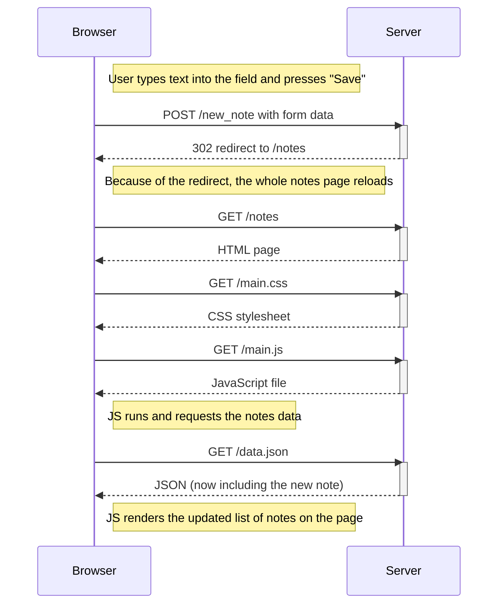

# Part 0 – Diagrams

## 0.4: Adding a new note (traditional page reload)

## 0.5: Loading the SPA

sequenceDiagram
participant Browser
participant Server

    Browser->>Server: GET /spa
    activate Server
    Server-->>Browser: HTML document
    deactivate Server

    Browser->>Server: GET /main.css
    activate Server
    Server-->>Browser: CSS stylesheet
    deactivate Server

    Browser->>Server: GET /spa.js
    activate Server
    Server-->>Browser: JavaScript for the SPA
    deactivate Server

    Note right of Browser: The SPA JS sets up event listeners and then asks for notes

    Browser->>Server: GET /data.json
    activate Server
    Server-->>Browser: JSON with existing notes
    deactivate Server

    Note right of Browser: Browser uses JS to display the notes (without full reloads)

## 0.6: Creating a note in SPA

sequenceDiagram
participant Browser
participant Server

    Note right of Browser: User submits a note in the SPA interface

    Note right of Browser: JS prevents the default page reload, creates a note object, updates local state, and re-renders instantly

    Browser->>Server: POST /new_note_spa with note JSON
    activate Server
    Server-->>Browser: 201 Created (success)
    deactivate Server

    Note right of Browser: UI already shows the new note. Optionally, the SPA may fetch /data.json again to stay consistent.
